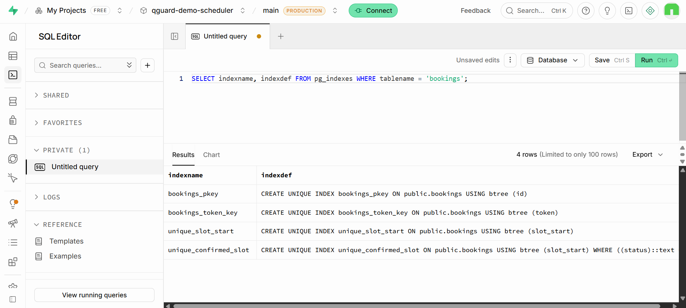
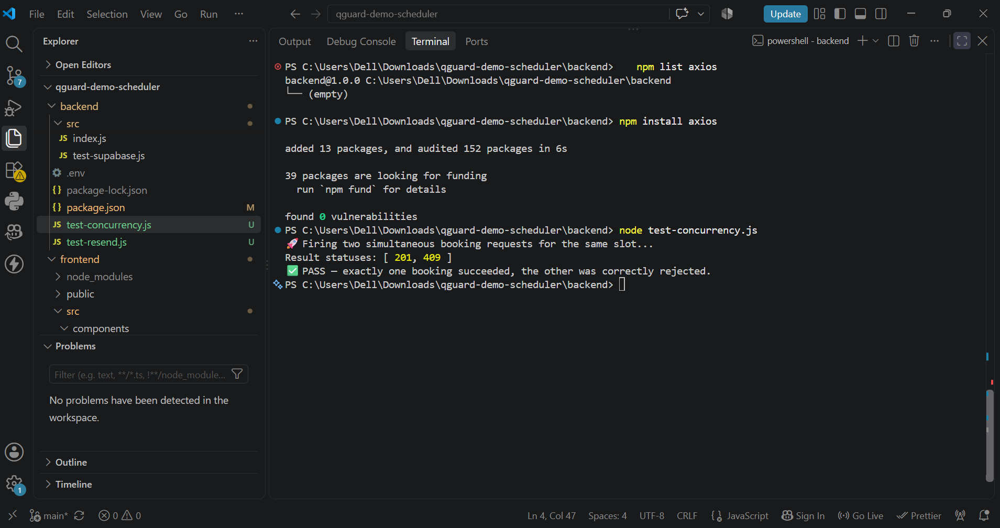
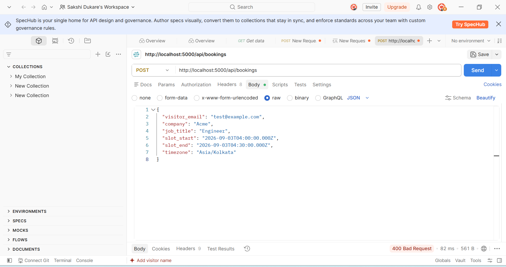
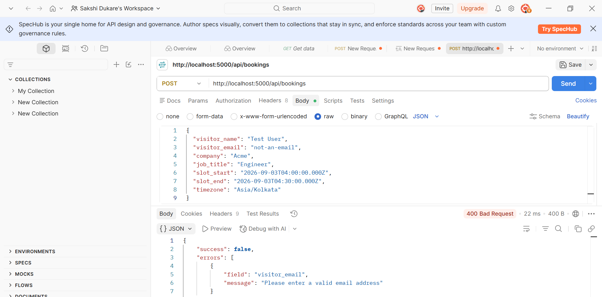
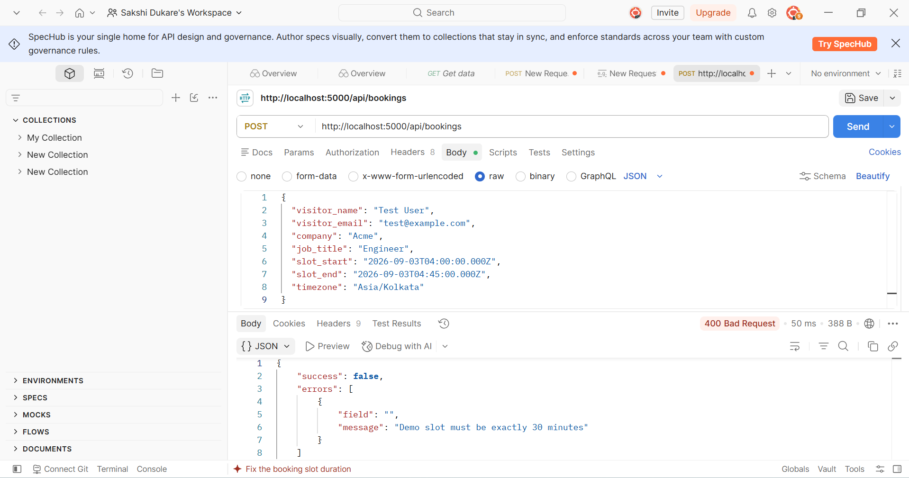
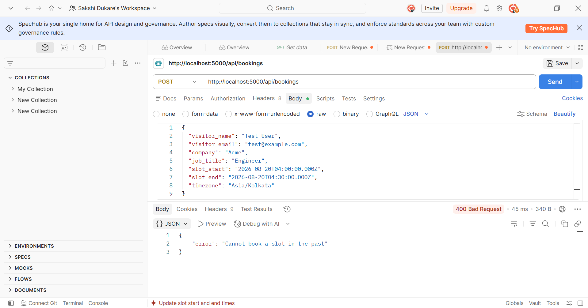
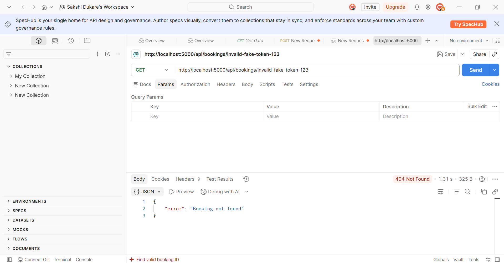

# 🧪 Testing Documentation — QGuard Demo Scheduler

This document summarizes the manual, API, and concurrency testing performed against the local development environment (`localhost:5000` backend, `localhost:3000` frontend) prior to deployment.

> 📁 Screenshots referenced below are stored in the [`Screenshots/`](Screenshots/) folder in this repository.

---

## 1. Manual End-to-End Flow Testing

Full visitor journey tested through the actual UI, following the required flow:

`QGuard Page → Enter Details → Select Time → Confirm → Email + Calendar Invite → Reschedule / Cancel`

| Step | Result |
|------|--------|
| Load booking page and fill visitor details | ✅ Pass |
| Select an available (non-booked, non-past) slot | ✅ Pass |
| Review & confirm modal shows correct details | ✅ Pass |
| Booking saved to Supabase `bookings` table with status `CONFIRMED` | ✅ Pass |
| Confirmation page displays correct name, email, date, time, and timezone | ✅ Pass |
| Confirmation email received via Resend | ✅ Pass |
| Email correctly shows time converted to the visitor's selected timezone | ✅ Pass |
| `.ics` calendar invite attached to email | ✅ Pass |
| `.ics` file successfully imported into Outlook calendar with correct date/time | ✅ Pass |
| Reschedule link loads booking and allows selecting a new slot | ✅ Pass |
| Rescheduling releases the old slot and books the new one | ✅ Pass |
| Cancel link updates booking status to `CANCELLED` | ✅ Pass |
| Cancelling releases the slot (confirmed via `/api/slots`) | ✅ Pass |

The complete end-to-end flow was manually verified through the browser, including booking, confirmation, email, rescheduling, and cancellation.

---

## 2. Double-Booking Prevention (Concurrency Testing)

### Why this matters

A sequential "check, then insert" approach at the application level has a race-condition window. Two requests arriving at nearly the same time could both pass the "is this slot free?" check before either request writes its booking.

The assessment requires double-booking prevention at the **backend/database level**, so this was tested using genuinely simultaneous requests rather than sequential manual clicks.

### Database Constraint

```sql
CREATE UNIQUE INDEX unique_confirmed_slot
ON bookings (slot_start)
WHERE status = 'CONFIRMED';
```

The constraint was verified using:

```sql
SELECT indexname, indexdef
FROM pg_indexes
WHERE tablename = 'bookings';
```

### Evidence



### Concurrency Test Script

`backend/test-concurrency.js` fires two `POST /api/bookings` requests for the **same slot** using `Promise.allSettled`, ensuring both requests are in flight at approximately the same time.

Run using:

```bash
node test-concurrency.js
```

### Result

```text
🚀 Firing two simultaneous booking requests for the same slot...

Result statuses: [ 201, 409 ]

✅ PASS — exactly one booking succeeded, the other was correctly rejected.
```

### Evidence



One request succeeded with `201 Created`, while the other was rejected with `409 Conflict`.

The conflict is handled using the PostgreSQL unique constraint (`error.code === '23505'`) in `createBooking`, rather than relying only on the earlier application-level availability check. This closes the race-condition window at the database level.

The same constraint-violation handling is also applied in `rescheduleBooking`, so rescheduling into an already-booked slot is rejected in the same way.

---

## 3. API Validation Testing (Postman)

Negative and validation testing was performed against:

- `POST /api/bookings`
- `GET /api/bookings/:token`

The tests confirm that the API rejects invalid input with clear, structured errors instead of crashing or silently accepting invalid requests.

| # | Test | Input | Expected | Actual | Result |
|---|------|-------|----------|--------|--------|
| 1 | Missing required field | No `visitor_name` | `400` | `400` — `"Name is required"` | ✅ Pass |
| 2 | Invalid email format | `visitor_email: "not-an-email"` | `400` | `400` — `"Please enter a valid email address"` | ✅ Pass |
| 3 | Invalid slot duration | 45-minute slot instead of 30 | `400` | `400` — `"Demo slot must be exactly 30 minutes"` | ✅ Pass |
| 4 | Past slot booking | `slot_start` in the past | `400` | `400` — `"Cannot book a slot in the past"` | ✅ Pass |
| 5 | Nonexistent booking token | `GET /api/bookings/invalid-fake-token-123` | `404` | `404` — `"Booking not found"` | ✅ Pass |

### Evidence

#### 1. Missing Required Name



#### 2. Invalid Email



#### 3. Wrong Slot Duration



#### 4. Past Slot



#### 5. Invalid Booking Token



All error responses return structured JSON such as:

```json
{
  "error": "Booking not found"
}
```

or:

```json
{
  "success": false,
  "errors": []
}
```

This prevents raw stack traces or database error messages from being exposed to the client.

---

## 4. Boundary & Edge-Case Testing

| Test | Result |
|------|--------|
| Requesting slots for a weekend date | `400` — `"Weekends are not available"` |
| Requesting slots for a date already partially/fully in the past | Past slots excluded from response (`isPast` filtered server-side, not just hidden in UI) |
| Rescheduling a `CANCELLED` booking | Rejected — `"Cannot reschedule cancelled booking"` |
| Cancelling an already-`CANCELLED` booking | Rejected — `"Booking already cancelled"` |

These tests confirm that invalid dates, unavailable slots, and invalid booking states are handled by the backend rather than relying only on frontend validation.

---

## 5. Timezone Testing

| Test | Result |
|------|--------|
| Auto-detected timezone on page load | Correctly detected via `moment.tz.guess()` |
| Changing timezone dropdown updates displayed slot times | ✅ Verified |
| Confirmation modal shows time in selected timezone | ✅ Verified |
| Confirmation page shows time in selected timezone | ✅ Verified |
| Confirmation email shows time in selected timezone rather than server-local time | ✅ Verified |
| Date-query timezone bug | 🔧 Identified and fixed |

### Timezone Details

The confirmation email was tested to ensure that the displayed time is converted to the visitor's selected timezone rather than using the server's local time.

A date-query issue was also identified where selecting a calendar date and converting it using `.utc()` before querying `/api/slots` could shift the requested date by one day for users in certain timezones.

This was fixed by removing the unnecessary `.utc()` conversion from `fetchSlots`.

---

## 6. Known Minor Issue (Not Blocking)

The email validation chain performs an MX-record DNS lookup even when the input has already failed the basic email-format validation.

For example:

```text
not-an-email
```

is rejected correctly with a `400` response, but the custom DNS validation may still execute because multiple `express-validator` custom validators in the same chain can run even after an earlier validation failure.

This does not affect correctness because invalid email addresses are still rejected. It only results in unnecessary DNS work for obviously invalid input.

This has been identified and can be optimized in a future cleanup.

---

## 7. Local vs. Deployed Testing

All results documented above were captured against the **local development environment**:

```text
Backend:  localhost:5000
Frontend: localhost:3000
```

This was intentional because local testing allows faster debugging and iteration.

A previous environment-specific issue demonstrated the importance of testing after deployment as well: Gmail SMTP failed with `ENETUNREACH` on the Render network even though the same functionality worked locally.

Therefore, after deployment, the same test suite should be re-run against:

- Render backend
- Vercel frontend
- Supabase production database
- Resend email service

The booking/date parameters should be adjusted to valid future dates when repeating the tests on the deployed environment.

---

## 8. Testing Summary

The following areas were successfully tested locally:

| Testing Area | Status |
|---------------|--------|
| Manual booking flow | ✅ Pass |
| Booking confirmation | ✅ Pass |
| Supabase booking storage | ✅ Pass |
| Email delivery | ✅ Pass |
| Timezone conversion | ✅ Pass |
| Calendar `.ics` invite | ✅ Pass |
| Rescheduling | ✅ Pass |
| Cancellation | ✅ Pass |
| Double-booking prevention | ✅ Pass |
| Database unique constraint | ✅ Pass |
| API validation | ✅ Pass |
| Invalid booking token handling | ✅ Pass |
| Weekend validation | ✅ Pass |
| Past-slot validation | ✅ Pass |
| Cancelled booking protection | ✅ Pass |

---

## Tools Used

- **Postman** — API request and response testing
- **Node.js script (`test-concurrency.js`)** — concurrent request simulation using `Promise.allSettled`
- **Manual browser testing** — complete user flow
- **Outlook desktop** — `.ics` calendar invite import verification
- **Supabase SQL Editor** — database constraint verification